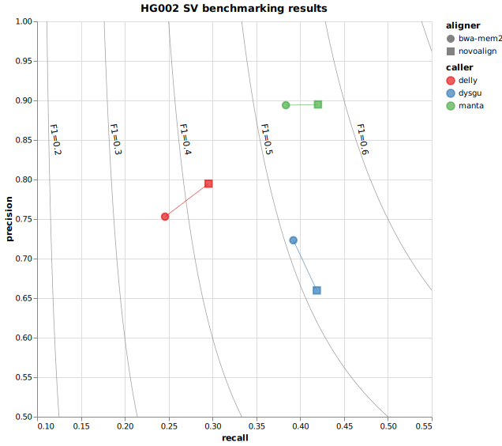

# Novocraft SV benchmarking

> [!NOTE]
> [Skip to results](#results-default-workflow)

## Introduction

This repository contains a Snakemake workflow used to compare the performance of SV callers when different short-read aligners are used. Originally it was designed to compare SV calls by Manta on BAM files produced with NovoAlign and BWA-MEM2, although it can be extended to compare other SV callers or aligners.

If NovoAlign performs well, an SV calling pipeline could potentially be incorporated into Novocraft's products.

## Usage

> [!TIP]
> Instructions on how to deploy this workflow can be found [here](https://snakemake.github.io/snakemake-workflow-catalog?repo=jsquaredosquared/novocraft-sv-benchmarking), or you can continue reading for more details.

The benchmarking process has been implemented as a Snakemake workflow (found in `workflow/Snakefile`). The workflow can be configured by editing the `config/config.yaml` file. Tools can be added if they are available in the working environment or can be accessed using Snakemake's conda or docker integrations. The command-line options for each tool can be modified according to your needs.

The default workflow performs the following steps:

### `00_prepare`

This step downloads all the inputs required to run the default workflow.

| Sample                                                                                            | Reference                                                                                          | SV truth set                                                                                                                        |
| ------------------------------------------------------------------------------------------------- | -------------------------------------------------------------------------------------------------- | ----------------------------------------------------------------------------------------------------------------------------------- |
| [HG002](https://github.com/human-pangenomics/HG002_Data_Freeze_v1.0) (Illumina WGS 150 bp PE 30x) | [GIAB GRCh37](https://ftp-trace.ncbi.nlm.nih.gov/ReferenceSamples/giab/release/references/GRCh37/) | [HG002 SVs Tier 1](https://ftp-trace.ncbi.nlm.nih.gov/ReferenceSamples/giab/release/AshkenazimTrio/HG002_NA24385_son/NIST_SV_v0.6/) |

These files are downloaded to a folder called `resources`.

If you are using your own datasets, you will need to download them yourself and edit the paths in the config file.

### `01_align`

This step aligns the FASTQ reads for each sample listed in the "samples" section of the config file and produces a CRAM file for each aligner listed in the "aligners" section of the config file. This workflow currently works with the following aligners:

- [x] [BWA-MEM2](https://github.com/bwa-mem2/bwa-mem2)
- [x] [NovoAlign](https://www.novocraft.com/products/novoalign/)

Other aligners can be added, provided that a samtools-indexed CRAM file is produced.

The location of the reference genome can be specified in the config file. The various indexes required by the aligners must be produced using the relevant tools (e.g., `samtools index`, `novoindex`, `bwa-mem2 index`) and made available in the same directory as the reference genome.

### `02_call`

This step takes each CRAM file and calls structural variants using each SV caller listed in the "callers" section of the config file. For each caller, the default settings recommended by the developer were used. This workflow currently works with the following callers:

- [x] [Delly](https://github.com/dellytools/delly)
- [x] [Dysgu](https://github.com/kcleal/dysgu)
- [x] [Manta](https://github.com/Illumina/manta)

Other callers can be added, provided that they accept a CRAM file and produce a bgzipped, tabix-indexed SV VCF file.

The output is generally in the form `outputs/{caller}/{sample}.{aligner}.{caller}.vcf.gz`.

### `03_benchmark`

This step uses `truvari bench` to compare each SV VCF file to the truth set to calculate the performance characteristics (recall, precision, F1 score). This workflow calculates the overall performance characteristics, as well as the performance characteristics by SVTYPE.

The default `truvari bench` settings were used, with the following exceptions:

- Sequence comparison was turned off (`--pctseq`) because the SV VCF is not guaranteed to have sequence-resolved calls.
- The size of SVs was limited using the options `--sizemin 50` (common definition of SV) and `--sizemax 1_000_000` (because larger events are more likely to be erroneous).
- Only variants with `FILTER == PASS` are considered (`--passonly`).

As per the default settings, 2 SVs are considered the same if:

- they have the same SVTYPE (`--typeignore False`)
- the distance between their breakends is less than 500 bp (`--refdist 500`)
- the size of the smaller SV is at least 70% the size of the larger SV (`--pctsize 0.7`)

The output is generally in the form `outputs/truvari/{sample}.{aligner}.{caller}[.{svtype|svlen}].truvari-bench.json`.

### `04_compare`

This step compares the performance characteristics for each aligner/caller pair.

The final image can be found in `results/final_plot.svg`.

## Results (default workflow)

### Using NovoAlign improves recall and F1 on HG002 SV benchmark

|     | sample | aligner   | caller | svtype |       f1 |   recall | precision |
| --: | :----- | :-------- | :----- | :----- | -------: | -------: | --------: |
|   0 | HG002  | novoalign | manta  | ALL    | 0.571953 | 0.420278 |  0.894923 |
|   1 | HG002  | bwa-mem2  | manta  | ALL    | 0.536922 | 0.383682 |  0.893961 |
|   2 | HG002  | novoalign | dysgu  | ALL    |  0.51246 |  0.41893 |  0.659755 |
|   3 | HG002  | bwa-mem2  | dysgu  | ALL    |  0.50857 | 0.392183 |  0.723189 |
|   4 | HG002  | novoalign | delly  | ALL    | 0.430774 | 0.295459 |  0.794757 |
|   5 | HG002  | bwa-mem2  | delly  | ALL    | 0.370741 | 0.245905 |  0.753016 |

_NOTE: HG002 SV benchmark only includes SV types DEL and INS._

## Acknowledgements

This work was part of my internship at [Novocraft](www.novocraft.com) (July 2024 - September 2024).
